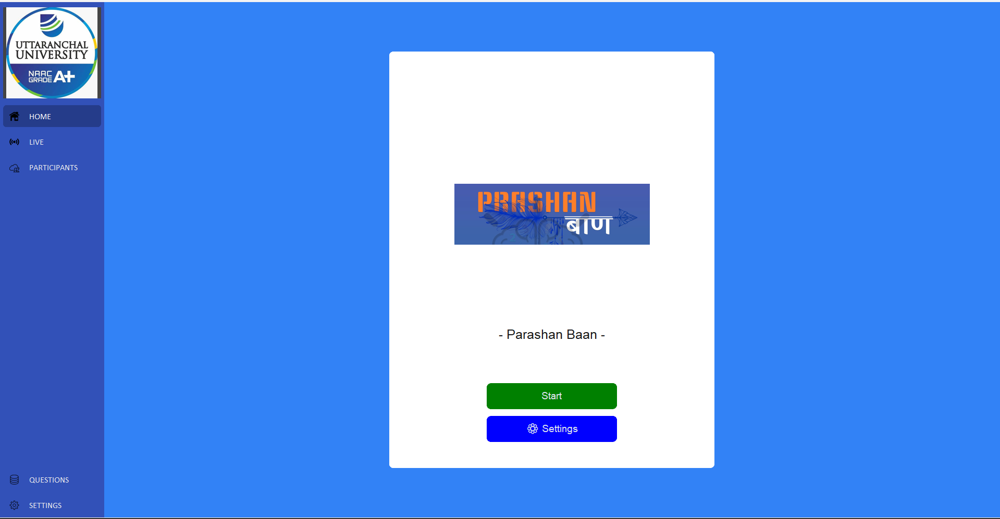
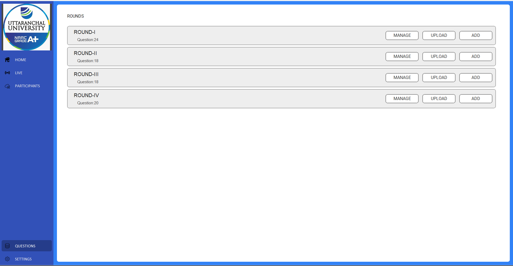
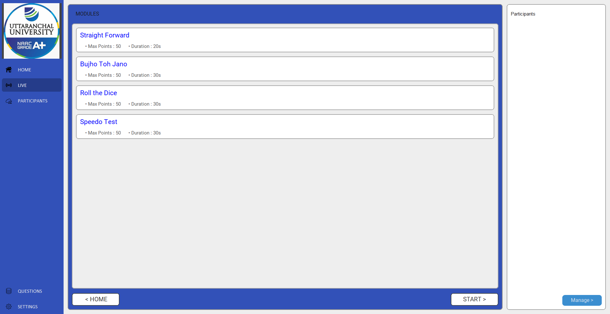

## QUIZ APP
### For Prashan Baan Competition

Quiz App is a lightweight desktop Python application to run fully offline quiz competitions. "Offline" means no internet; participants connect to the ADMIN laptop using a local wireless network (hotspot / Wi‑Fi) and native sockets.

### Highlights
- Works offline over a local hotspot (star topology: admin is the hub).
- Admin controls rounds, questions, scoring and live scoreboard.
- Participant clients connect to the admin and answer in real time.

### Repository layout (important files)
- Admin entry: [admin.py](admin.py)
- Participant entry: [participant.py](participant.py)
- App core: [app/](app/)
- UI code: [app/ui/](app/ui/)
- Question CSVs: [data/questions/](data/questions/)
- Requirements: [requirements.txt](requirements.txt)

### Prerequisites
- Python 3.8+ installed on all machines.
- All devices on the same local network (admin laptop creates hotspot or uses Wi‑Fi).
- Allow Python through any host firewalls (Windows Defender, etc.).

### Installation
1. Clone or copy this project folder to each laptop.
2. (Recommended) Create and activate a virtual environment:

	### Using the included Windows executables (no Python required)

	#### To extract Windows exe files
	1. Double click the "Prashan Baan.exe" file.
	2. Choose the output directory (I prefer Desktop).
	3. Click on Extract and wait for it to complete.
	4. After completion close the extractor and open the output directory.

	#### After extraction
	- Admin executable: Prashan Baan\admin\admin.exe
	- Participant executable: Prashan Baan\participant\participant.exe

	#### Run the executables
	- Double‑click the `.exe` file from File Explorer, or run from a command prompt to see runtime logs:

	```powershell
	cd "Prashan Baan\admin"
	.\admin.exe

	-- and on participant machines --

	cd "Prashan Baan\participant"
	.\participant.exe
	```

	#### Notes when using the executables
	- The Admin machine must still act as the network hub (hotspot/Wi‑Fi) so participants can connect.
	- Allow the `.exe` through Windows Firewall if participants cannot connect; the same network & firewall tips above apply.
	- The executables include the application binaries and embedded resources under their `data/` subfolders; do not delete those directories.

	### Running the app

	#### Admin (host)
	1. On the laptop that will be the host (ADMIN), create a hotspot or ensure all participant devices can reach the ADMIN machine over Wi‑Fi.
	2. Open a terminal in the project root and activate the virtualenv.
	3. Start the admin process:

		```bash
		python admin.py
		```

	4. The Admin application presents a GUI for loading question rounds, starting rounds, viewing the live scoreboard, and controlling the flow.

	#### Participant (client)
	1. On each participant laptop, connect to the ADMIN's hotspot or the same local network.
	2. Activate the virtualenv and run:

		```bash
		python participant.py
		```

	3. Follow the on‑screen prompts in the Participant client to connect to the Admin (you may be asked for the ADMIN IP or to select from discovered hosts).
	4. Once connected, participants will receive questions and submit answers; scores update on the Admin's live scoreboard.
- Double‑click the `.exe` file from File Explorer, or run from a command prompt to see runtime logs:

```powershell
cd "Prashan Baan\admin"
.\admin.exe

-- and on participant machines --

cd "Prashan Baan\participant"
.\participant.exe
```

#### Notes when using the executables
- The Admin machine must still act as the network hub (hotspot/Wi‑Fi) so participants can connect.
- Allow the `.exe` through Windows Firewall if participants cannot connect; the same network & firewall tips above apply.
- The executables include the application binaries and embedded resources under their `data/` subfolders; do not delete those directories.


### Network & Firewall tips
- Ensure the ADMIN machine's IP is reachable from participant machines (same subnet).
- If participants cannot connect, temporarily turn off Windows Firewall to test connectivity; if that fixes it, add an inbound rule to allow Python or the app's port.

### Customizing questions
- Edit or replace CSVs in [data/questions/](data/questions/). CSVs in `data/questions/` follow the format used by the app (see sample files `r1.csv`, `r2.csv`, ...).

### Screenshots
Below are a few screenshots of the Admin UI and live rounds. Files are in the `docs/screenshots` folder included with this repo.







### Troubleshooting
- If the UI doesn't appear, check Python version and dependency installation.
- If participants fail to connect, verify network connectivity and firewall settings.

### Where to look in code
- Settings and configurable values: [app/settings.py](app/settings.py) and [app/cli/settings.py](app/cli/settings.py)
- Network sockets and server logic: [app/lib/sockets.py](app/lib/sockets.py)
- Admin UI entry point: [app/ui/admin/main.py](app/ui/admin/main.py)

### Extras
- I can add a step-by-step screenshot walkthrough in `docs/screenshots/` and embed captions.
- I can create `run_admin.bat` and `run_participant.bat` for Windows convenience.

---
Last updated: 2025-12-29